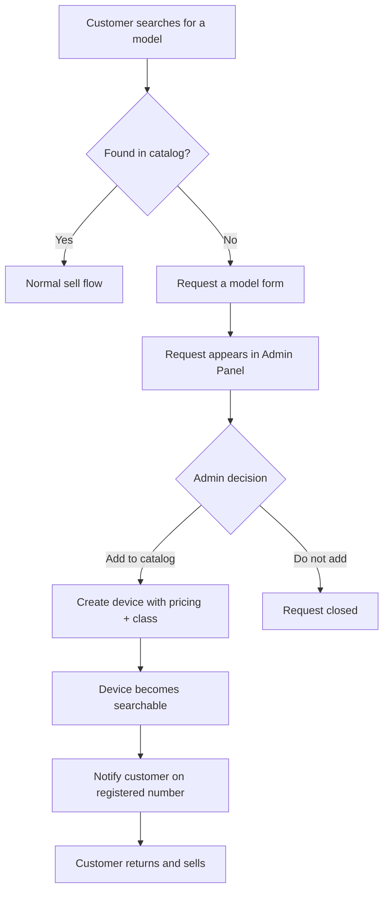

## Overview

Cashkr search only returns **active products that already have pricing and a class assigned**. A customer looking for a model Cashkr does not list hits a dead end — no result, no quote, no lead.

The **Request a model** form closes that gap. The customer tells Cashkr what they want to sell, the request lands in the Admin Panel, an admin adds the device to the catalog, and the customer is notified on their registered number once it is available.

<Callout kind="info">
This turns a dropped customer into a tracked demand signal. Without it, someone searching for an unlisted model simply leaves and nothing is recorded.
</Callout>

## The request form

<Columns cols={2}>

<Card title="What the customer sees" icon="smartphone">

A dialog titled **Request a model**, with the line "Tell us what you want to sell and our team will add it to Cashkr."

</Card>

<Card title="What they are promised" icon="bell">

"We'll notify you on your registered number once the model is added." The notification is the commitment — see the operational note below.

</Card>

</Columns>

### Fields

<ParamField body="deviceType" param-type="select" required="true" show-location="false">

The device category, chosen from a dropdown that defaults to **Select a device type**. This is the only constrained field — it should map to the device types Cashkr already supports so the request is routable.

</ParamField>

<ParamField body="brand" param-type="string" required="true" show-location="false">

Free-text brand name. Not validated against the existing brand list, since the point of the form is to capture things Cashkr does not yet have.

</ParamField>

<ParamField body="model" param-type="string" required="true" show-location="false">

Free-text model name. Where the form is launched from a search that returned nothing, this arrives pre-filled with what the customer typed.

</ParamField>

<Callout kind="alert">
**Brand and model are free text.** Expect misspellings, partial names, and junk entries. Admins reviewing requests should treat these as a customer's rough description rather than a catalog identifier, and match to a real device before acting.
</Callout>

## Lifecycle

<Steps>
  <Step title="Customer submits the request" icon="send">
    The customer picks a device type and types the brand and model, then submits.
  </Step>
  <Step title="Request reaches the Admin Panel" icon="inbox">
    It appears in the Model Requests section for review. See [Model Requests — Admin](/admin-model-requests).
  </Step>
  <Step title="Admin adds the device" icon="plus">
    The admin creates the device in the catalog under the right device type, with variants, **base price, and a class**.
  </Step>
  <Step title="Customer is notified" icon="bell">
    Once the model is live, the customer is notified on their registered number.
  </Step>
</Steps>

## Adding the device is not one step

<Callout kind="alert">
**Creating a device record is not enough to fulfil the request.** Search excludes any product that is inactive or missing pricing or class.

If an admin creates the device but does not assign a base price and a class, the model still will not appear in search. A customer notified at that point would return, search again, and find nothing — a worse experience than never being notified.

Only notify after confirming the model is actually searchable.
</Callout>

A device is genuinely fulfilled when all of the following are true:

| Requirement | Why |
| --- | --- |
| Product is **active** | Inactive products are excluded from search. |
| **Base price** is set | Without it the pricing engine cannot produce a quote. |
| A **class** is assigned | The class holds every deduction value. No class means the device cannot be priced. |
| Correct **device type** | Determines which vendors can ever see the resulting orders. |

See [Classes](/classes) and [Device Pricing Fields Overview](/device-pricing-fields-overview).

## Why this is worth watching as a signal

Each request is a customer who wanted to sell and could not. Taken together they are the clearest available demand signal for catalog gaps — more direct than traffic or search logs, because the customer explicitly asked.

Repeated requests for the same model are a strong argument for prioritising that device. Requests for a device type Cashkr does not support at all are a different signal entirely, and worth escalating rather than closing.

## Open questions

<Callout kind="alert">
The following are **not yet confirmed** and are listed so the gaps are visible rather than assumed. Someone with implementation knowledge should confirm and remove this section.
</Callout>

<Expandable title="Does the customer have to be logged in?" default-open="false">
Unknown. The form promises notification on the "registered number," which implies an existing account, but it is not documented whether a logged-out visitor can submit, and if so how they would be contacted.
</Expandable>

<Expandable title="Which channel is the notification sent on?" default-open="false">
Unknown. "Registered number" indicates phone, but not whether it is SMS, WhatsApp, or a push notification. Cashkr uses several channels elsewhere — see [Customer Notifications](/customer-notification).
</Expandable>

<Expandable title="What happens when a request is declined?" default-open="false">
Unknown. If Cashkr decides not to add a model, it is not documented whether the customer is told, left waiting indefinitely, or the request is silently closed.

The form makes an unconditional promise to notify, so silent closure would break a stated commitment.
</Expandable>

<Expandable title="Are duplicate requests merged?" default-open="false">
Unknown. Because brand and model are free text, the same device can arrive spelled several different ways. It is not documented whether requests are deduplicated or counted, which affects whether demand can be measured.
</Expandable>

<Expandable title="Is there rate limiting or spam protection?" default-open="false">
Unknown. Two free-text fields with no validation are an obvious junk vector. It is not documented whether submissions are throttled per user.
</Expandable>

<Expandable title="Is the form available in the Customer App?" default-open="false">
Unknown. The form is confirmed on the website. Whether the Customer App offers the same path when a search returns nothing is not documented.
</Expandable>

<Expandable title="Is the original request linked to the eventual order?" default-open="false">
Unknown. Tracking whether notified customers actually return and sell is the only way to know if the feature pays for itself. It is not documented whether that link exists.
</Expandable>

## Related pages

<Columns cols={2}>

<Card title="Model Requests — Admin" href="/admin-model-requests" icon="layers" cta="Open admin guide">

Reviewing incoming requests, adding the device, and notifying the customer.

</Card>

<Card title="Search Functionality" href="/search-functionality" icon="search" cta="See search rules">

Why unlisted models return nothing, and the active-plus-pricing-plus-class rule behind it.

</Card>

<Card title="Classes" href="/classes" icon="layers" cta="Understand classes">

The deduction values a device needs before it can be priced at all.

</Card>

<Card title="Customer Notifications" href="/customer-notification" icon="bell" cta="See channels">

How Cashkr reaches customers across its notification channels.

</Card>

</Columns>
