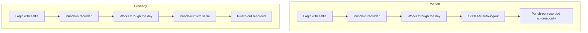

## Overview

Cashkr records attendance for vendors and their cashboys through the Vendor App. Attendance is tied to **login with a selfie** rather than a separate punch-in screen — logging in is the punch-in.

Punch-out works differently for the two roles, and that difference determines what the data can and cannot tell you.

<Callout kind="info">
**Cashboy** is the internal name for a vendor's field agent. The Vendor App calls them agents; the backend calls them cashboys. See [Add Agents](/add-agents) for how they are created.
</Callout>

## How punch-in and punch-out work

| | Vendor | Cashboy |
| --- | --- | --- |
| **Punch-in** | Logs into the Vendor App with a selfie | Logs in with a selfie — same as vendor |
| **Punch-out** | **Automatic** at 12:00 AM daily via auto-logout | **Manual**, with a selfie |
| **Selfie on exit** | No | Yes |
| **Controls their own end time** | No | Yes |

<Callout kind="alert">
**A vendor's punch-out time is not when they stopped working.** Every vendor day is closed by the midnight auto-logout regardless of when they actually finished.

This means vendor attendance answers "did they show up today" and nothing more. Any report presenting vendor hours worked, shift length, or end-of-day time is measuring the auto-logout, not the vendor. Do not build SLA or productivity metrics on vendor session duration.

Cashboy punch-out is explicit, so cashboy durations are meaningful in a way vendor durations are not.
</Callout>

## Selfies

Selfies are captured at vendor login, cashboy login, and cashboy punch-out. They exist so attendance reflects a real person present at that moment rather than a session someone else could open.

<Callout kind="alert">
Selfies are photographs of identifiable people captured on a recurring basis. Retention period, who can view them, and whether they are verified against anything or only stored are **not documented** — see the open questions below. These should be settled explicitly rather than left to implementation default.
</Callout>

## Where attendance is visible

<Columns cols={2}>

<Card title="Vendors see their own cashboys" icon="users">

A vendor can view the attendance of the cashboys registered under their account, so they can see who was present on a given day.

</Card>

<Card title="Admins see everything" icon="layers">

Vendor and cashboy attendance appear in the Admin Panel under each vendor's detail panel, alongside devices, pincodes, credits, and tier access. See [Vendors - B2C](/b2c-vendors).

</Card>

</Columns>

A vendor does **not** see other vendors' attendance. Scoping follows the same vendor boundary as agents and orders.

## Open questions

<Callout kind="alert">
The following are **not yet confirmed**. Several relate to endpoints that exist in the backend but were not covered in the feature description. They are listed so the gaps are visible rather than assumed.
</Callout>

<Expandable title="Is location tracked during a shift?" default-open="false">
**Unconfirmed and important.** The backend exposes `POST /attendance/heartbeat` (summarised as "Locationheartbeat") and `GET /attendance/live-map` ("live map marker"). Together these suggest position is reported on an interval and rendered on a live map.

None of this was part of the attendance description above, and none of it is documented. If location is being collected, the following need answering before this page can be considered complete:

- How often the heartbeat fires
- Whether tracking is bounded by the shift or runs while the app is open
- How long location history is retained
- Who can view the live map
- Whether vendors and cashboys are told they are tracked, and whether they consent

Until confirmed, do not assume either that tracking happens or that it does not.
</Expandable>

<Expandable title="What does the admin override do?" default-open="false">
Unknown. `PATCH /attendance/{id}/override` is summarised as "update admin status". It is not documented who can override an attendance record, what values can be set, whether the original record is preserved, or whether the change is audited.

An unaudited ability to edit attendance is worth pinning down, since attendance may feed performance or payment decisions.
</Expandable>

<Expandable title="What happens if a cashboy never punches out?" default-open="false">
Unknown. Cashboy punch-out is manual, so a forgotten punch-out leaves the record open. It is not documented whether the midnight auto-logout closes cashboy sessions too, whether the record stays open indefinitely, or whether an admin has to intervene.
</Expandable>

<Expandable title="Which timezone is midnight?" default-open="false">
Unknown. The auto-logout is described as 12:00 AM. Whether that is IST, server time, or device local time is not documented. It determines which calendar day a late-evening session is attributed to.
</Expandable>

<Expandable title="What happens to a vendor working past midnight?" default-open="false">
Unknown. The auto-logout presumably interrupts an active session. It is not documented whether an in-progress order, inspection, or call is affected, or whether the vendor simply logs back in and starts a new attendance day.
</Expandable>

<Expandable title="Are selfies verified or only stored?" default-open="false">
Unknown. It is not documented whether the selfie is matched against a reference photo, reviewed by anyone, or simply captured and stored. This determines whether the selfie is a real control or a formality.
</Expandable>

<Expandable title="How long are attendance records and selfies retained?" default-open="false">
Unknown. `GET /attendance/export` produces a CSV download, which implies records leave the system. Retention, export access, and what the CSV contains are undocumented.
</Expandable>

## Backend endpoints

Attendance is served by the endpoints below. All currently carry **no request or response schemas** in the API reference — the summaries are the entire specification.

| Endpoint | Summary | Side |
| --- | --- | --- |
| `POST /attendance/punch-in` | Punch in | Field |
| `POST /attendance/punch-out` | Punch out | Field |
| `GET /attendance/status` | Today's attendance status | Field |
| `POST /attendance/heartbeat` | Location heartbeat | Field |
| `GET /attendance/roster` | Paginated roster table | Admin |
| `GET /attendance/summary` | Attendance KPI summary | Admin |
| `GET /attendance/live-map` | Live map markers | Admin |
| `GET /attendance/export` | CSV download | Admin |
| `PATCH /attendance/{id}/override` | Update admin status | Admin |

<Callout kind="info">
The API tag for these is spelled `Vendor Attandance` in the source export, so it renders that way in the API reference. Worth correcting at the source before the next export.
</Callout>

## Related pages

<Columns cols={2}>

<Card title="Attendance in the Vendor App" href="/vendor-app-attendance" icon="smartphone" cta="See vendor flow">

What vendors and cashboys actually do, and how a vendor reviews their cashboys' attendance.

</Card>

<Card title="Vendors - B2C" href="/b2c-vendors" icon="users" cta="Open admin view">

Where admins review vendor and cashboy attendance inside the vendor detail panel.

</Card>

<Card title="Add Agents" href="/add-agents" icon="user-plus" cta="Manage cashboys">

How cashboys are registered under a vendor, including the internal-vendor rule for rejected applicant numbers.

</Card>

<Card title="Vendor Registration & Login" href="/vendor-registration-login" icon="log-in" cta="See login flow">

The login that doubles as the attendance punch-in.

</Card>

</Columns>
